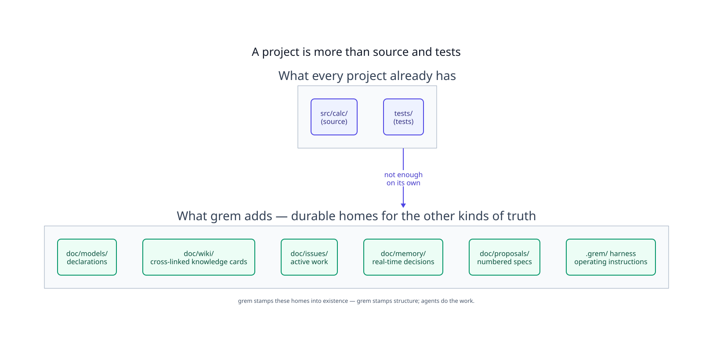
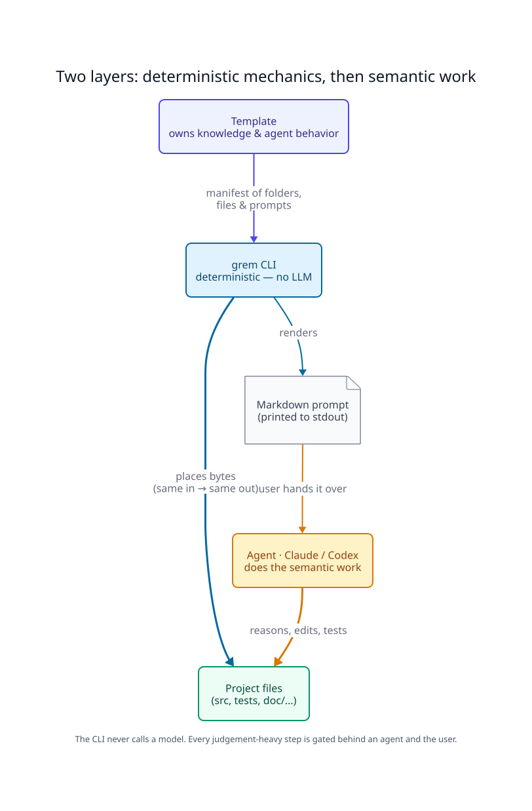
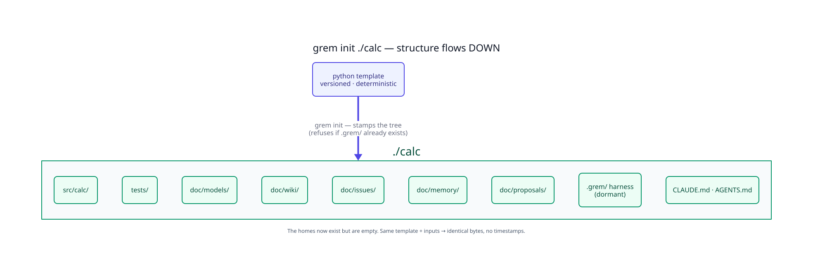
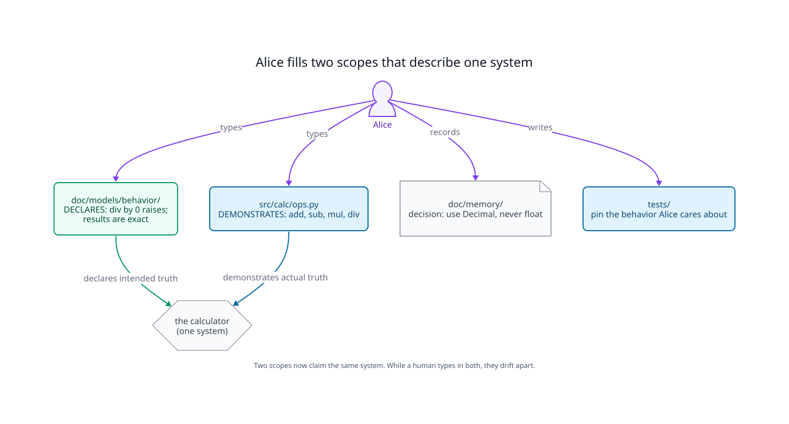
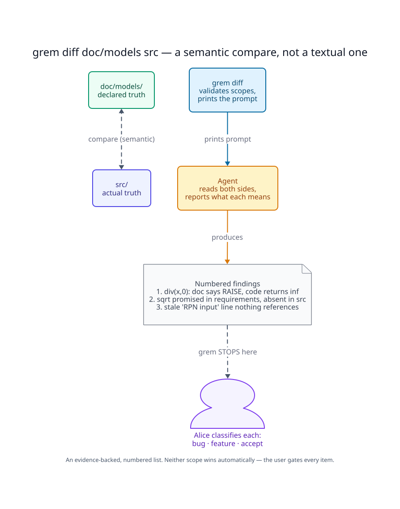
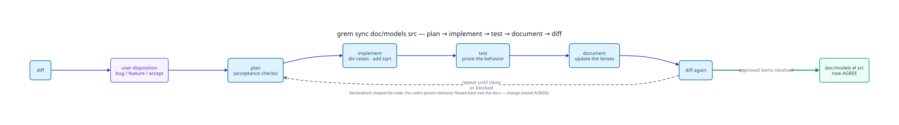
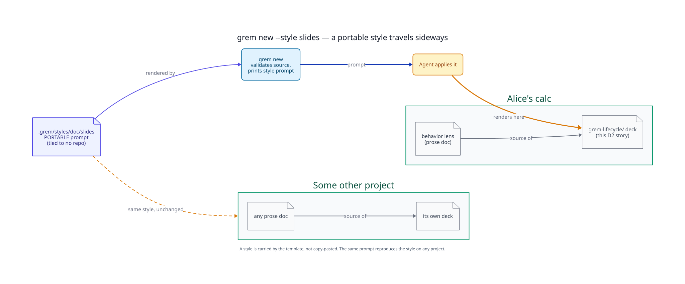
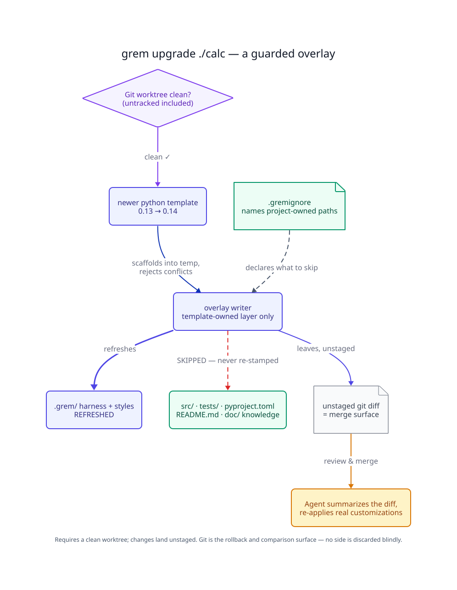
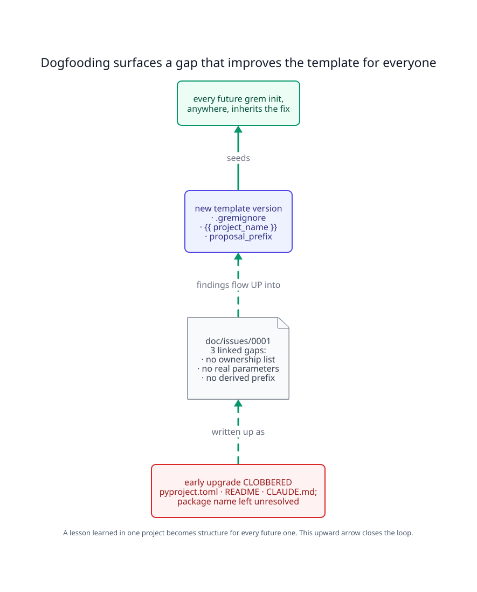
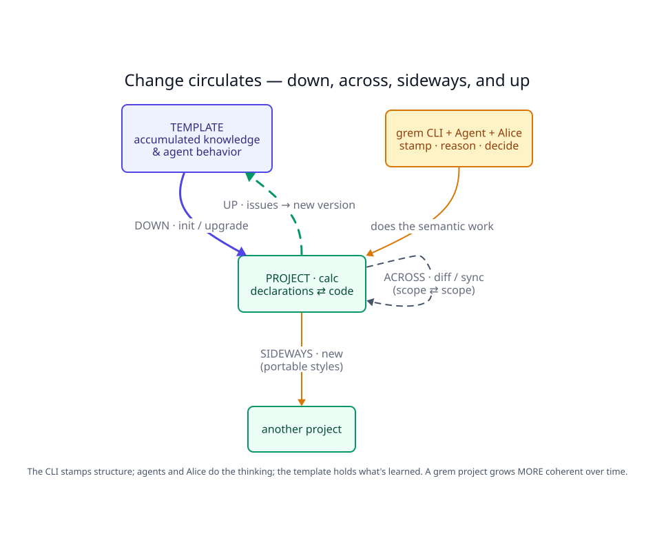

# grem lifecycle — a visual story

A numbered D2 deck that retells [../grem-lifecycle.md](../grem-lifecycle.md) as
one idea per slide. This README is the **short version**; the prose doc is the
long one. Follow Alice as she builds a Python **calculator** with grem and change
travels in every direction — **down** from the template, **across** her scopes,
**sideways** to other projects, and **up** into the template itself.

> Sources are the `.d2` files; the `.svg` images are committed build artifacts so
> the deck renders here without the D2 toolchain. Rebuild with `./build.sh`
> (needs `d2`; `brew install d2 librsvg`). A `.d2` changed without its `.svg`
> twin is an incomplete change.

---

## 1. A project is more than source and tests

An AI-assisted project needs durable *homes* for the kinds of truth that scatter
otherwise: declarations, a cross-linked wiki, active work, real-time decisions,
numbered proposals, and the agents' own operating instructions. `src/` and
`tests/` alone are not enough — grem stamps the homes; agents do the work.



## 2. Two layers: deterministic mechanics, then semantic work

grem keeps two layers strictly apart. The **CLI** is deterministic — it places
bytes and prints prompts, and never calls a model. The **template** owns the
knowledge and agent behavior. **Agents** do the judgement-heavy work, always
gated behind the user. That separation is what makes grem safe next to real code.



## 3. Init — structure flows down

`grem init ./calc` stamps the whole tree: `src/calc/`, `tests/`, the `doc/`
knowledge base, agent instruction files, and the dormant `.grem/` control layer.
This is the most literal propagation — template structure flowing **down** into a
project. The homes now exist, but they are empty.



## 4. Declare and build — the project comes alive

Alice works in two scopes at once: `doc/models/` *declares* how the calculator
must behave (division by zero raises; results are exact), `src/calc/`
*demonstrates* it, `doc/memory/` records the decision to use `Decimal`, and
`tests/` pin it down. Two scopes now claim the same system — and while a human
types in both, they drift.



## 5. Diff — drift made visible

`grem diff doc/models src` is a *semantic* compare, not a textual one. The agent
reads both sides and returns a numbered, evidence-backed list: `div(x, 0)` should
raise but returns `inf`; a promised `sqrt` is missing; a stale line lingers. grem
deliberately **stops there** — neither scope is authoritative, so Alice classifies
each item herself.



## 6. Sync — the reconciliation loop

`grem sync doc/models src` runs the full loop:
`diff → user disposition → plan → implement → test → document → diff`, repeating
until the approved items are resolved or blocked. Declarations shaped the code,
and the code's proven behavior flowed back into the docs. Change moved **across**,
and the two scopes agree again.



## 7. Styles — knowledge flows sideways

`grem new --style slides` applies a **portable** style prompt — one tied to no
repo — to a source doc; the agent produces the output (this very deck). The same
style lifts into an unrelated project unchanged. Knowledge moves **sideways**,
carried by the template rather than copy-pasted.



## 8. Upgrade — structure flows down again, but guarded

`grem upgrade ./calc` is the one command that touches files, so it is fenced in:
it requires a clean Git worktree, overlays only the **template-owned** layer, and
uses `.gremignore` to protect **project-owned** paths from being re-stamped. The
changes land unstaged — Git is the merge and rollback surface, and the agent
helps reconcile the diff.



## 9. Feedback — lessons flow up

The `.gremignore` boundary exists because someone dogfooded upgrade and got
burned: an early overlay clobbered `pyproject.toml`, `README.md`, and `CLAUDE.md`.
That pain became a numbered issue naming three gaps, which flowed **up** into a
new template version (`.gremignore`, parameterization, a derived
`proposal_prefix`). Every future `grem init` inherits the fix — the arrow that
makes grem a loop.



## 10. The whole loop — one circulation

Put end to end, change circulates: **down** (`init` / `upgrade`), **across**
(`diff` / `sync`), **sideways** (`new`), and **up** (issues → new version). The
CLI stamps structure, agents and Alice do the thinking, and the template holds
what's learned. Around that triangle, a grem project grows *more* coherent over
time instead of less.



---

## Rebuilding the deck

```console
./build.sh              # render every NN-*.d2 → .svg (SVG only)
WITH_PNG=1 ./build.sh   # also emit .png via rsvg-convert (librsvg)
```

`build.sh` is a thin wrapper over the single shared renderer at
[../../../../scripts/render-d2.sh](../../../../scripts/render-d2.sh). Without a
local `d2`, render one file with the Docker fallback:
`docker run --rm -v "$PWD":/w -w /w terrastruct/d2:latest in.d2 out.svg`.

## Related documentation

- Source (long version): [../grem-lifecycle.md](../grem-lifecycle.md)
- Upstream-feedback archetype: [../../../issues/0001-incomplete-init-and-upgrade.md](../../../issues/0001-incomplete-init-and-upgrade.md)
- Project overview and command model: [../../../../README.md](../../../../README.md)
- Agent operating manual: [../../../../.grem/harness/README.md](../../../../.grem/harness/README.md)
